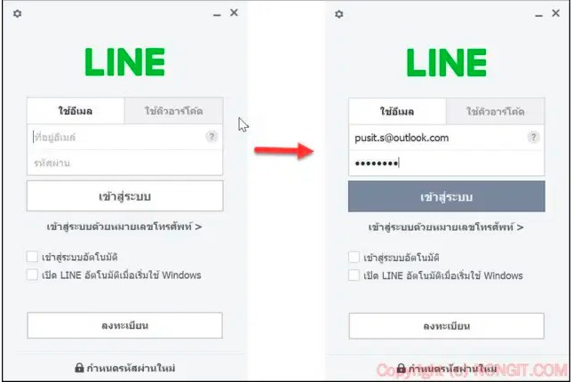
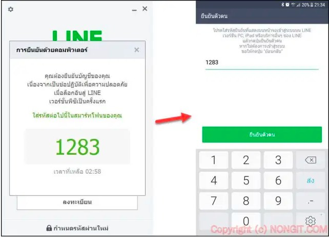

# Line Application Two Factor Authentication

## Line installation on pc

step 1  * Downlond & Install program Line on PC  

step 2  * Open line PC new app  

step 3  * 1.Login from E-mail & Password 2. scan QR code  

step 4  * Response number from line PC  
step 5  * Authentication from mobile phone number  
step 6  * Mobile number OK & pin number OK pass

### Team Author
* Sanchat Phaisit
* Keaittisak Luithong
